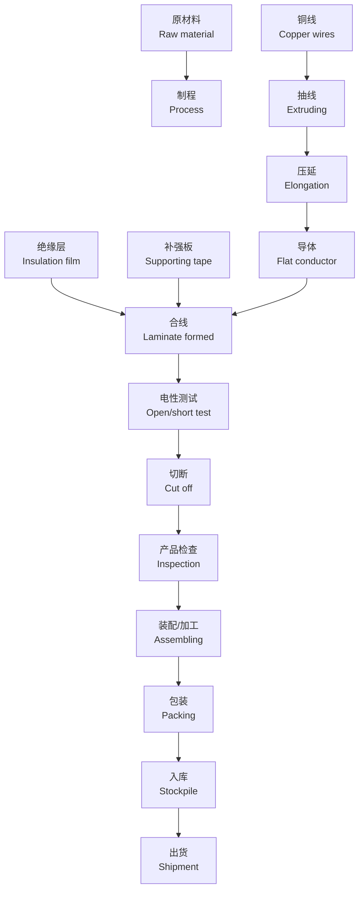

# FFC 簡介 & 設計規範

![JI-HAW INDUSTRIAL CO.,LTD. logo with company name in Chinese and English]

Perfect technology and innovative spirit that poise to embrace the international trend.

# 今皓實業股份有限公司
**JI-HAW INDUSTRIAL CO.,LTD.**

❖ 一、產品應用介紹

❖ 二、FFC 發展优势

❖ 三、FFC 產品结构

❖ 四、FFC 設計规范

❖ 五、FFC 生产设备

❖ 六、FFC 產品类型

# 1. 產品應用介紹

## 1-1 多功能事務機

[THIS IS FIGURE: Left image shows a large white multifunction printer/copier machine with touchscreen display and multiple paper trays]

[THIS IS FIGURE: Top right image shows what appears to be printed documents or paper with text]

[THIS IS FIGURE: Middle right image shows what appears to be flat ribbon cables or connectors in white/light colors]

[THIS IS FIGURE: Bottom right image shows what appears to be flat flexible cables or connectors arranged in parallel]

多功能事務機 ---LVDS FFC 、SATA FFC

# FFC 定义：

柔性扁平电缆线（FFC - Flexible Flat Cable）具有体积小、柔性好、可弯曲等使用及易焊接等特性，可随意选择导体数目及间距，使联线更方便，大大减少电子产品的体积，减少生产成本，提高生产效益；

# FFC 的用途：

产品广泛用于数码相机、摄像机、DVD、VCD、CD-ROM、电脑、手机、打印机、传真机、扫描仪、电视机、MP3、音响设备、汽车安全气囊、液晶显示器、微型电机、安防、LCD、LED、电话机、医疗设备、天车、服装印花机、电子电器设备、验钞机、微型马达、车载电视、移动电话、个人掌上电脑、行车记录仪、鼠标、POS机、喇叭机、录像机、影碟机、音响设备、舞台灯光、条形扫描器、红外线扫描器等！

# 一、FFC 的特点：

❖ 1. 与传统的带状电缆相比由于使用了仅一半厚的绝缘膜，显得小、轻、薄，最适合机器的小型化与高密度化。

❖ 2. 优越的柔软性和弯曲性，具有可挠美于柔性线路板的特性。

❖ 3. 由于未使用 PVC，废弃时不会有氯化物污染环境；绝缘膜与导体粘着连接，没有传统形带状电缆两端导体浮起现象。

❖ 4. 导体的表面经过处理，插入后具有优越的可靠性，相对于普通的 FFC 比较容易焊接，不易氧化。

❖ 5. 可以接受画线、印字、贴麦拉、弯折、定型加工等追加加工。

# 二、FFC 产品结构

## FFC 是有导体、PET 绝缘膜和加强板组成

**侧示图**

导体有扁形导体和圆形导体。
PET 绝缘膜有白色和黑色之分。
加强板有蓝色（浅蓝色）、黑色、
黄色及乳白色之分。

[THIS IS FIGURE: Two cross-sectional diagrams showing the structure of FFC cables with labeled components:
- 绝缘层 (Insulation layer)
- 导体 (Conductor)
- 加强板 (Reinforcement plate)
- 绝缘层 (Insulation layer)]

# 导体 Conductor

导体一般用裸铜、锡铜材料和镍铜材料  
导体有扁形导体和圆形导体

金属电阻率排列：银、铜、金、铝、钙、钨、镁、  
金比银化学稳定性和硬度都高，可焊性也很好，镀银与  
镀金工艺相比，更乐观镀金，银银的耐腐蚀性不如金好，  
而且镀银时间长了银层也会出现氧化，慢慢变黑。

![Conductor cross-section diagram showing layers labeled Cu 铜, Sn 锡, Ni 镍, Au 金]

| 间距 | 类别 | 宽 [mm] | 厚 [mm] | 镀镍载面积 [mm] | 等间距镀面积 [mm] | 最小载面积 [mm] | 导电率 [%] | 镀镍 DCR [Ω/m] | 最大 DCR [Ω/m] | 近似 AWG # |
|------|------|---------|---------|-----------------|-----------------|-------------|-----------|---------------|--------------|------------|
| 0.5 | K | 0.25 | 0.080 | 0.0200 | 0.160 | 0.0194 | 93.15 | 0.925 | 0.954 | 34 |
|     | H | 0.30 | 0.035 | 0.0105 | 0.116 | 0.0102 | 93.15 | 1.763 | 1.817 | 37 |
|     | A | 0.30 | 0.050 | 0.0150 | 0.138 | 0.0146 | 93.15 | 1.234 | 1.272 | 35 |
|     | R | 0.30 | 0.070 | 0.0210 | 0.164 | 0.0204 | 93.15 | 0.881 | 0.909 | 34 |
|     | S | 0.30 | 0.080 | 0.0240 | 0.175 | 0.0233 | 93.15 | 0.771 | 0.795 | 33 |
|     | Q | 0.50 | 0.050 | 0.0250 | 0.178 | 0.0243 | 93.15 | 0.740 | 0.763 | 33 |
|     | U | 0.50 | 0.100 | 0.0500 | 0.252 | 0.0485 | 93.15 | 0.370 | 0.382 | 30 |
|     | T | 0.60 | 0.028 | 0.0168 | 0.146 | 0.0163 | 93.15 | 1.102 | 1.136 | 35 |
|     | B | 0.60 | 0.035 | 0.0210 | 0.164 | 0.0204 | 93.15 | 0.881 | 0.909 | 34 |
| 1 | C | 0.60 | 0.050 | 0.0300 | 0.195 | 0.0291 | 93.15 | 0.617 | 0.636 | 32 |
|     | D | 0.60 | 0.100 | 0.0600 | 0.276 | 0.0582 | 93.15 | 0.308 | 0.318 | 29 |
|     | E | 0.70 | 0.035 | 0.0245 | 0.177 | 0.0238 | 93.15 | 0.755 | 0.779 | 33 |
|     | J | 0.70 | 0.050 | 0.0350 | 0.211 | 0.0340 | 93.15 | 0.529 | 0.545 | 32 |
|     | N | 0.70 | 0.100 | 0.0700 | 0.299 | 0.0679 | 94.16 | 0.262 | 0.270 | 28 |
|     | F | 0.80 | 0.035 | 0.0280 | 0.189 | 0.0272 | 93.15 | 0.661 | 0.681 | 33 |
|     | G | 0.80 | 0.050 | 0.0400 | 0.226 | 0.0388 | 93.15 | 0.463 | 0.477 | 31 |
|     | I | 0.80 | 0.100 | 0.0800 | 0.319 | 0.0776 | 94.16 | 0.229 | 0.236 | 28 |
| 1.25~2.0 | Q | ⌀ | 0.252 | 0.0499 | 0.252 | 0.0484 | 93.15 | 0.371 | 0.383 | 30 |
|     | M | ⌀ | 0.330 | 0.0855 | 0.330 | 0.0830 | 94.16 | 0.214 | 0.221 | 28 |
|     | L | ⌀ | 0.400 | 0.1257 | 0.400 | 0.1219 | 94.16 | 0.146 | 0.150 | 26 |
|     | P | ⌀ | 0.474 | 0.1765 | 0.474 | 0.1712 | 94.16 | 0.104 | 0.107 | 25 |

# 绝缘层 Insulation

## 结构图示

**环保印字热融胶膜：**
- 热融胶层
- 印刷字层  
- PET

**环保无印字热融胶膜：**
- 热融胶层
- PET

## 产品特性

❖ PET 绝缘膜有白色和黑色之分。

❖ PET:FFC 的绝缘取决于 PET 的厚度，PET 的厚度不均直接影响 FFC 的电气性能。

❖ 油墨：由连结料（树脂）、颜料、填料、助剂和溶剂等组成

❖ 树脂：树脂通常是指受热后有软化或熔融范围，软化时在外力作用下有流动倾向，常温下是固态、半固态，有时也可以是液态的有机聚合物。

## 规格参数

**PET 聚酯胶膜的厚度有：** 37um、**43um**、50um、60um、70um、80um、92um、100um、105um

❖ **胶膜要求：** UL 94 VW-1

❖ **cUL FT1**

## 技术规格表

[THIS IS TABLE: Contains technical specifications with multiple rows showing various parameters including measurements, test conditions, and standards. The table shows values for different versions (V.0, V.1, V.2) with specific requirements for flame retardancy and other properties.]

# 加強板 Tape

[THIS IS FIGURE: A cross-sectional diagram showing three layers of tape structure with labels pointing to each layer:
- 熱融膠層 (top layer, white)
- 印刷油墨層 (middle layer, blue/purple)
- PET (bottom layer, yellow)]

❋ 加強板有藍色（淺藍色）、黑色、黃色及乳白色之分。

❋常用規格：55um 100um 130um 160um 183um 205um 215um 225um 250um 282um

# UL 规格及 Pitch

Pitch 种类：0.3mm 0.4mm 0.5mm 0.8mm 1.0mm 1.25mm 1.5mm 2.0mm
2.54mm 和特殊定做 Pitch。

UL 规格： 2643 2896 20624 20696 20706 20798 20861 20890 20941

| UL规格 | UL2643 | UL2896 | UL20696 | UL20624 | UL20798 | UL20706 | UL20861 | UL20890 | UL20941 |
|--------|---------|---------|----------|----------|----------|----------|----------|----------|----------|
| 额定温度 | 105°C | 80°C | 80°C | 80°C | 80°C | 105°C | 105°C | 105°C | 105°C |
| 额定电压 | 300V | 30V | 30V | 60V | 60V | 60V | 60V | 90V | 90V |
| 绝缘厚度 | 1.5mil Min | 0.8mil Min | 0.5mil Min | 1.2mil Min | 0.7mil Min | 0.8mil Min | 0.8mil Min | 1.5mil Min | 0.8mil Min |
| 导体规格 | 32-10AWG | 40-12AWG | 40-14AWG | 40-12AWG | 39-20AWG | 42-12AWG | 40-12AWG | 38-12AWG | 40-12AWG |
| 导体芯数 | 2-150 | 2-150 | 2-150 | 2-150 | 2-150 | 2-150 | 2-150 | 2-150 | 2-150 |

# 可靠性检测设备

## 1、RoHS 检测设备 / 膜厚测试仪：
（XGT-1000WR）
针对欧盟 ROSH 管零要求的重金属进行定性及定量检测；对电镀产品进行表面处理膜厚测试，精确得到其产品的测试结果

## 2、直流低电阻测试仪：
确保每批次进料导体的电阻值满足客户要求的性能

## 3、绝缘阻抗测试仪：
确保产品在额定电压下合适电气要求的电阻值内，满足客户电器要求。

## 4、耐压测试仪：
确保产品在额定电压下安全运转及能够达到间隙和爬电距离，从而确定合适绝缘材料和芯线之间的距离；验证绝热、湿气或污浊空气对连接器绝缘材料绝缘阻抗的影响。

## 5、二次元影像仪：
在光射下，通过调节强弱光和高度增加产品的清晰度，与显示器相接合及产品的精密尺寸，使产品以图片的形式出现在显示界面上，更好的保证产品精确度。

## 6、自动插拔力机：
验证端子设计是否合适工程分析及连接器承受各种环境压力前后插拔的所需的力量，包括正向力测试，接点插拔力与拔出力测试，连接器整体插拔力，端子保持力。

# 可靠性检测设备

## 7、耐曲折测试仪：
确保产品曲折性能达到行业标准要求。

## 8、耐曲绕测试仪：
确保产品曲绕性能达到行业标准要求。

## 9、盐雾试验机：
通过设定机器的时间，盐水浓度，温度，模拟产品在海边潮湿，咸热的环境下，验证产品端子和铁件表面的腐蚀程度。

## 10、耐磨擦测试仪：
确保产品摩擦性能达到行业标准要求。

## 11、自动插拔力机--延伸率测试：
确保产品的延伸率能达到行业标准要求。

## 12、恒温恒湿试验机：
通过设定机器的温度和时间，循环次数来验证产品在高低温及潮湿的环境下，产品其机械和电气特性的影响。

# 三、設計規範

## 一、0.5Pitch 規格設計：

### 1. FFC 導體寬度：
一般 0.5Pitch ZIF Connectot 導體寬度要求為 0.3mm&0.35mm 兩種，在 FFC 與 PCB 焊接時導體寬度若為 0.35mm 時則間隔只剩 0.15mm，很容易造成短路，故當客戶端設計使用 0.35mm 時需建議客戶只能使用 0.3mm

### 2. FFC 導體厚度：
一般設計導體厚度為 0.035mm，其耐電流為一根導體 0.45(A)，當客戶要求耐電流超過 0.45(A) 時可將導體厚度改為 0.05mm，其耐電流可提高到 0.65(A)，若客戶還要求更高時，則建議客戶不可使用此設計，需改成 1.0Pitch Connector

### 3. PCB 焊點設計：
#### (1) PAD 寬度：
FFC 導體寬度設計為 0.3mm，故 PCB PAD 設計在 0.32mm，使其間隙還剩 0.18mm，避免焊接短路

#### (2) PAD 長度：
因 FFC 導體寬度與 PCB PAD 寬度相近，故 PCB 焊點長度設計上需將 PAD 拉長，使其焊接可讓錫從前端焊入，避免造成冷焊現象，故 PCB PAD 長度設計為 2.0mm，

# 一、0.5Pitch 規格設計：

## 4. FFC 導體長度：
如第3點所述，PCB PAD 長度設計在2.0mm，使其錫可從前端焊入，故FFC 導體長度在1.3 ±0.3mm，使其導體最前端最小值有0.4mm，最大值有1.0mm，相當於導體占PAD 1/2~2/3

![Technical diagram showing PCB PAD and FFC specifications with measurements:
- PCB and PCB PAD labeled at top
- FFC component shown
- Dimensions marked: 0.32, 0.30, 0.50, 1.30, 2.00 (measurements in mm)
- Cross-sectional view of the connector assembly]

# 二、1.0Pitch 規格設計：

## 1. FFC 導體寬度：
一般0.5Pitch ZIF Connectot 導體寬度要求為0.5mm&0.65mm 兩種，其兩種規格之寬度均可使用

## 2. FFC 導體厚度：
一般設計導體厚度為0.05mm，其耐電流為一根導體1.0(A)，當客戶要求耐電流超過1.0(A) 時可將導體厚度改為0.1mm，其耐電流可提高到2.0(A)，若客戶還要求更高時，則建議客戶不可使用此設計，需改成Wire

## 3. PCB 焊點設計：
### (1) PAD 寬度：
FFC 導體寬度設計為0.5mm 時，故PCB PAD 設計在0.65mm.  
FFC 導體寬度設計為0.65mm 時，故PCB PAD 設計在0.73mm.

### (2) PAD 長度：
因FFC 導體寬度與PCB PAD 寬度相近，故PCB 焊點長度設計上需將PAD 拉長，使其焊接可讓錫從前端焊入，避免造成冷空焊現象，故PCB PAD 長度設計為2.0mm，

# 一、1.0 Pitch 規格設計：

## 4. FFC 導體長度：
如第3點所述，PCB PAD 長度設計在2.0mm，使其錫可從前端焊入，故FFC 導體長度在1.3 ±0.3mm，使其導體最前端最小值有0.4mm，最大值有1.0mm，相當於導體佔PAD 1/2~2/3

[THIS IS FIGURE: Two technical diagrams showing cross-sectional views of FFC (Flexible Flat Cable) connections to PCB pads. The diagrams include measurements and labels for:
- PCB
- PCB PAD  
- FFC
- Various dimensions including 0.65, 0.50, 1.00, 0.73, 1.30, 2.00, 5.00
- 導體寬度 (conductor width): 0.5mm and 0.65mm respectively]

# 四、生产设备

## 生产流程图



# 導體压延流程圖

## 流程圖

```
圓導體              挤压                 压延              導體
(Cu+Sn,Cu+Ni) → Extrusion → Press → Conductor
     ↓
圓導體
Round Wire         压延
                  Press
```

[THIS IS FIGURE: Process flow diagram showing the conductor rolling process, starting from round conductor material (Cu+Sn, Cu+Ni), going through extrusion and pressing stages to create the final conductor. The diagram includes visual representations of the cross-sectional changes throughout the process.]

[THIS IS FIGURE: Two photographs showing industrial rolling/pressing equipment - appears to be machinery used in the conductor manufacturing process described in the flow chart above.]

# 贴合机流程图

[The image shows a technical flow chart diagram at the top showing the laminating machine process flow with various components like Guide Roller, Pitch Roller, and temperature specifications (90±15°C, 169±20°C, etc.)]

[Below the flow chart are three photographs showing:
1. Left: A large industrial facility with multiple laminating machines arranged in rows
2. Top right: Close-up of laminating equipment in operation
3. Bottom right: Control panel and monitoring equipment for the laminating process]

# 自動噴碼畫線流程

[Images showing automated coding and line drawing equipment and processes]

☑ 成卷噴印定位線及 MB,IO 等標識
☑ 速度比手工及移印書提升了約 2.5 倍
☑ 畫線比手工及移印更均勻，無歪斜漏畫
☑ 尺寸精準，劃線公差 +/-0.3mm

# 自動貼輔材流程

[Two images showing automated auxiliary material application process - left image shows machinery with feeding mechanism, right image shows close-up of material application]

☒ 成卷貼鋁箔，大大提高產能
☒ 貼合平整無歪斜劣紋現象．
☐ Impendance 控制誤差更小．

# 自动冲切机

![Automatic punching machine with control panel and display screens]

## 整体结构图

![Structural diagram showing labeled components:]
- 冲切马达机构 (Punching motor mechanism)
- 冲切机构 (Punching mechanism)
- 送料机构 (Feeding mechanism)
- 操作系统 (Operating system)
- 放料轴 (Material feeding shaft)

## 由高清 CCD 定位冲切作业
## 冲切精度误差 ±0.02mm 以内
## 能满足不同形态 FFC 冲边需求

# 自動折彎機

![Automatic bending machine on the left showing industrial equipment with robotic arm, and bent metal strip sample on the right]

☑ 成卷彎折痕後自動裁切，大大提高 產能  
☑ 速度比手工提升了約３倍 產能充足  
☑ 折線精準，且可防止人為折斷線.

# 五、FFC 产品类型

## 产品 / product

- LVDSFFC
- USB FFC
- HDMI FFC
- SATA FFC
- PCBA FFC
- Other one FFC

[The image contains two sections showing various FFC (Flexible Flat Cable) products:

1. Top section: Shows a green circuit board with multiple white flat cable connectors and components arranged on it

2. Bottom section: Displays two rows of different colored flat flexible cables - the top row shows cables in pink/orange, green/pink, yellow, yellow, and blue/yellow combinations; the bottom row shows various flat cables in gray, black, and white colors with different connector types]

# JI-HAW INDUSTRIAL CO.,LTD.

## 1> LVDS FFC 应用产品
### LVDS FFC Application of the product

**笔记本电脑**  
Notebook computers

**高画质 LCD TV**  
High-definition LCD TV

**多功能事务机**  
Multi-function transaction machine

[The image shows various electronic devices and components including:
- A printer/scanner device
- An LCD TV/monitor displaying a landscape
- A circuit board/PCB
- A laptop computer
- Various LVDS FFC cables and connectors
- Electronic components and cable assemblies arranged in a grid layout]

# 2> USB FFC 应用产品
## USB FFC FFC Application of the product

### 笔记本电脑
**Notebook computers**

### 高画质 LCD TV
**High-definition LCD TV**

### 多功能事务机
**Multi-function transaction machine**

[The image shows various electronic devices including laptops, LCD monitors, tablets, and USB FFC cable components and connectors arranged in two sections - the top showing end products and the bottom showing the actual cable components and connectors.]

# 3> HDMI FFC 应用产品
**HDMI FFC Application of the product**

- DVD Player
- Note Book  
- PDP/HDTV/LTV

![DVD Player with remote control and disc]

![HDTV/monitor display showing landscape]

![Laptop computer]

[Bottom section shows various HDMI FFC cable connectors and assemblies in different configurations]

# 4> SATA FFC 应用产品
## SATA FFC Application of the product

**数位相框**  
Digital photo frame

**笔记本电脑**  
Notebook computers

**掌上型电脑**  
Handheld computers

[THIS IS FIGURE: The image shows three electronic devices - a digital photo frame displaying a nature scene, a laptop computer with blue screen, and a handheld tablet device with blue interface]

[THIS IS FIGURE: Below are two images showing SATA FFC cable components - one showing a single flat flexible cable connector, and another showing multiple flat cable connectors arranged in parallel]

# 5> PCBA FFC 应用产品
## PCBA FFC Application of the product

### 各类按键 PCBA
### All kinds of buttonsPCBA

[Images showing various PCBA FFC button applications including green circuit boards with cables and button assemblies]

# 6> 其它类 FFC
## Other one FFC

[Images showing various types of FFC (Flexible Flat Cable) products including ribbon cables, folded flexible circuits, and flat cable assemblies]

# Thank You

![JI-HAW INDUSTRIAL CO.,LTD. logo and company name in Chinese and English]

![Image showing a business handshake between two people in suits in what appears to be an office or business environment with windows in the background]

**今皓實業股份有限公司    Ji-Haw Industrial Co., Ltd.**

[JI-HAW logo appears at bottom left]