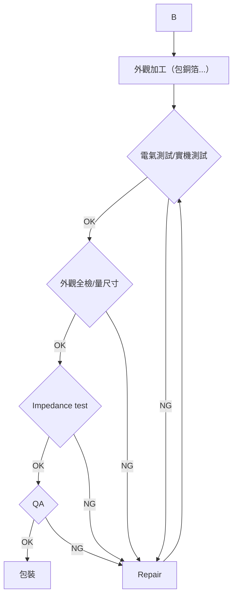

![JI-HAW INDUSTRIAL CO.,LTD. logo]

# EC產品工藝簡報

2016.09.08

*Perfected technology and innovative spirit that poise to embrace the pulse of global*

# JI-HAW INDUSTRIAL CO.,LTD.

EC 产品包括范围广泛：主要是 HDMI1.3,
HDMI1.4,
HDMI2.0,USB2.0,USB3.0,USB3.1,SATA,DP,DVI,
VGA 等

## 如下列举的是其中一款 DP TO DP 的加工工艺：

![Image showing DP to DP cable connectors - two black DisplayPort connectors with cables attached]

*Perfected technology and innovative spirit that poise to embrace the pulse of global*

# DP 工艺流程

## 工艺流程图

成型 SR
↓
预套 SR，绕线
↓
剥外被
↓
剪编织
↓
翻地线及编织，贴铜泊 → 镭射铝泊及棉线／去铝泊
↓                    ↓
挑铝泊，剪棉线        排线扣 (P1/P2)
                    ↓
                    剥芯线
                    ↓
                    预锡
                    ↓
                    装连接器
                    ↓
                    A

*Perfected technology and innovative spirit that poise to embrace the pulse of global*

[Note: The image contains two product photos on the right side showing cable assemblies/connectors]

# DP 工藝流程

```
A
↓
          高頻焊接 ←─────────────────────┐
         ╱    ╲                    │
        ╱  OK  ╲                   │
       ╱        ╲                  │
      ↓          ↓                 │
電氣測試 1/ 成型內模    焊點檢 NG ←─┘
      ↓          修 P1/P2
      ↓    OK ←──────┘
      ↓
   電氣測試 2 ←─ NG ─┐
      ↓             │
   OK ↓             │
      ↓             │  
    貼紙膠          │
      ↓             │
裝鐵殼 / 鉚鐵殼 / 焊鐵殼 ←─┘
      ↓
      B
```

[Image: Top right shows a close-up photograph of what appears to be a USB connector or similar electronic component]

[Image: Bottom right shows a photograph of USB connectors or plugs]

*Perfected technology and innovative spirit that poise to embrace the pulse of global*

# DP 工藝流程



[THIS IS FIGURE: Image of a black USB cable with connectors on both ends]

*Perfected technology and innovative spirit that poise to embrace the pulse of global*

# DP 制程工藝介紹

## 成型 SR

| Production Flow | Before | After |
|----------------|--------|-------|
| | ![Image showing hand operating machinery] | ![Image showing molding/pressing equipment] | ![Image showing final black molded part] |

**Explain: 打開成型機成型**

**注意: 確認機器正常運轉，確認無沖膠／溢料／異色／流紋／線材壓傷等不良。**

*Perfected technology and innovative spirit that poise to embrace the pulse of global*

# DP 制程工藝介紹

## 預套 SR、綠線

| Production Flow | Before | After |
|-----------------|--------|-------|
| | [Image showing wire/cable components on green surface] | [Image showing hands handling wire components] | [Image showing black cable connector] |

**Explain:** 拿取線材，進行線材整理。取1PCS SR 將 SR 小頭端朝內套到線材上。

*Perfected technology and innovative spirit that poise to embrace the pulse of global*

# DP 制程工藝介紹

## 剝外被

| Production Flow | Before | After |
|-----------------|--------|-------|
| [Image of production machinery] | [Image of cable before processing] | [Image of cable after processing] |

**Explain: 兩端剝皮 25±2mm，不可剝傷編織。**

*Perfected technology and innovative spirit that poise to embrace the pulse of global*

# DP 制程工藝介紹

## 剪編織

| Production Flow | Before | After |
|-----------------|---------|--------|
| [Image showing cable cross-section] | [Image showing frayed cable end with exposed wires] | [Image showing neatly trimmed cable end with annotation: 編織留5~7mm 地線不剪] |

**Explain:** 將線材剝皮口套上白色治具延治具边缘編織用剪刀修剪，修剪完成后編織留5~7mm。

---

*Perfected technology and innovative spirit that poise to embrace the pulse of global*

# DP 制程工藝介紹

翻地线及编织，贴铜箔

| Production Flow | Before | After |
|----------------|---------|-------|
| [Image of cable with exposed wires] | [Image of cable being processed with copper foil visible] | [Image of completed cable with copper foil wrapping] |

**Explain:** 将编织及地线后翻，延外被根部在编织上环包铜箔一圈半（铜箔 W=5mm L=30~32mm）。

---

*Perfected technology and innovative spirit that poise to embrace the pulse of global*

# DP 制程工藝介紹

**挑鋁箔，剪棉線**

| Production Flow | Before | After |
|----------------|--------|-------|
| [Image of cable with exposed aluminum foil and wires] | [Image of cable cross-section showing internal wires] | [Image of processed cable with organized wires] |

**Explain: 挑鋁箔，剪棉線.**

---

*Perfected technology and innovative spirit that poise to embrace the pulse of global*

# DP 制程工藝介紹

## 鑄射鋁浴及棉線 / 去鋁浴

| Production Flow | Before | After |
|----------------|---------|-------|
| |  |  |
| |  | |
| |  | |

*Perfected technology and innovative spirit that poise to embrace the pulse of global*

# DP 制程工藝介紹

## 排線扣 (P1/P2)

| Production Flow | Before | After |
|-----------------|--------|-------|
| | ![Circuit board connector with numbered pins 1-19 and 2-20] | ![Assembled cable with multiple colored wires connected to connector on green circuit board] |
| | ![Multiple colored wires (brown, red, blue, yellow, etc.) with copper shielding exposed] | |

**Explain:** 排線扣，排好一面后將線夾翻轉方向，以另一面朝上，再依編位表排線。

---

*Perfected technology and innovative spirit that poise to embrace the pulse of global*

# DP 制程工藝介紹

## 剝芯線

| Production Flow | Before | After |
|-----------------|--------|-------|
| [Image showing wire stripping process] | [Image showing wire before stripping] | [Image showing wire after stripping] |

**Explain:** 線扣放入剝皮機線扣槽中，踩下腳踏板，完成芯線剝皮。

---

*Perfected technology and innovative spirit that poise to embrace the pulse of global*

# DP 制程工藝介紹

## 預錫

| Production Flow | Before | After |
|-----------------|--------|-------|

[THIS IS FIGURE: Two images showing the pre-tinning process - "Before" image shows what appears to be a circular component or surface, "After" image shows white connectors with colored wires]

**Explain:** 導體沾少許助焊劑，將導體全部浸入錫爐內預錫 2+/-1s 秒鐘取出。

*Perfected technology and innovative spirit that poise to embrace the pulse of global*

# DP 制程工藝介紹

## 裝連接器

| Production Flow | Before | After |
|-----------------|--------|-------|
|                 | ![Connector before assembly - shows loose wires and connector components] | ![Connector after assembly - shows completed assembled connector] |

**Explain: 連接器裝入線槽中**

---

*Perfected technology and innovative spirit that poise to embrace the pulse of global*

# DP 制程工藝介紹

## 高頻焊接

| Production Flow | Before | After |
|---|---|---|
| ![High frequency welding process setup with equipment and components] | ![High frequency welding process in progress with connector being worked on] | ![Completed welded connector with multiple pins] |

**Explain:** 焊接連接器。

---

*Perfected technology and innovative spirit that poise to embrace the pulse of global*

# DP 制程工藝介紹

## 成型內模

| Production Flow | Before | After |
|-----------------|--------|-------|
| | [Image showing hands working with molding equipment - 圖二] | [Image showing mold with three cavities] | [Image showing finished molded part] |

**Explain: 成型內模.**

*Perfected technology and innovative spirit that poise to embrace the pulse of global*

# DP 制程工藝介紹

## 外观加工1 （包纸胶/装铁壳/铆铁壳/焊铁壳）

| Production Flow | Before | After |
|---|---|---|
| [USB connector image] | [Two images showing internal components and assembly process] | [Image showing finished product assembly] |

**Explain: 包纸胶/装铁壳/铆铁壳/焊铁壳**

*Perfected technology and innovative spirit that poise to embrace the pulse of global*

# DP 制程工藝介紹

## 外觀加工 2 （包銅箔/焊銅箔/裝塑殼）

| Production Flow | Before | After |
|-----------------|--------|-------|
| [Image showing wrapped component in foil] | [Image showing copper foil connection with text: 銅箔接縫處加錫拉焊] | [Images showing finished black plastic-encased components] |

**Explain:** 包銅箔/焊銅箔/組裝塑殼

---

*Perfected technology and innovative spirit that poise to embrace the pulse of global*

# DP 制程工藝介紹

## 电气检查-实机测试

| Production Flow | Before | After |
|-----------------|--------|-------|
| ![Connector insertion process] | ![Testing screen showing fail result] | ![Final testing display] |
| 两端连接器插好 | fail 不良品 | 良品 pass |

**Explain:** 进行电气，实机测试。

---

*Perfected technology and innovative spirit that poise to embrace the pulse of global*

# DP 制程工藝介紹

## 外觀檢查 ---- 量尺寸 ---- 絞線

| Production Flow | Before | After |
|----------------|---------|-------|
| [Image of USB connector] | 外被印字內容：<br>E118077-C AWM STYLE<br>20276 80°C 30V VW-1 JI-HAW | [Technical drawing with measurements and specifications] |
| [Image of cable cross-section] | 上下塑殼縫隙需 <0.15mm | |
| [Technical diagram showing cable assembly with measurements] | | |

**Explain: 根據 DP 外觀檢驗標準進行檢驗，ok 后量尺寸絞線。**

---

*Perfected technology and innovative spirit that poise to embrace the pulse of global*

# DP 制程工藝介紹

## 阻抗高頻測試

| Production Flow | Before | After |
|-----------------|---------|--------|
| | ![Before chart showing frequency response with blue line graph] | ![After chart showing improved frequency response with flatter curve] |

### Test Setup
[Image shows testing equipment with computer monitor and electronic measurement devices]

### Test Parameters and Results

**TDR FE ConnectorIMPZ , Tr= 130 ps (20%-80%)**

| Pin Name | Spec Min | Spec Max | Max Value | Min Value | Differ | Average | Status |
|----------|----------|----------|-----------|-----------|---------|---------|---------|
| ML0 | 105-110 | 90-95 | 102.97 | 94.64 | 8.33 | 98.81 | Pass |
| ML1 | 105-110 | 90-95 | 104.02 | 95.84 | 8.18 | 99.93 | Pass |
| ML2 | 105-110 | 90-95 | 102.17 | 94.81 | 7.36 | 98.49 | Pass |
| ML3 | 105-110 | 90-95 | 105.23 | 94.82 | 10.41 | 100.03 | Pass |
| AUX | 105-110 | 90-95 | 103.31 | 95.63 | 7.68 | 99.47 | Pass |
| Unit | Ohm | Ohm | Ohm | Ohm | Ohm | Ohm | |

**Explain: 高頻數據 (表格、圖示)**

---

*Perfected technology and innovative spirit that poise to embrace the pulse of global*

# Answer & Question

Thank you

*Perfected technology and innovative spirit that poise to embrace the pulse of global*